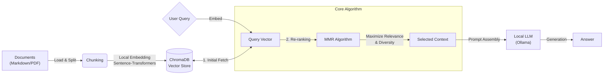

# Second-Brain-Local 🧠

     

> **Build Your Private Neural Extension.**
>
> 一个基于本地大模型 (Local LLM) 与 RAG 技术、100% 隐私安全的个人知识库问答系统。不仅是存储，更是为了通过多视角检索激活沉睡的知识。

## 🔭 Vision (愿景)

作为一名计算机专业的学生，我每天都在处理海量的信息——论文、代码片段、技术博客和个人笔记。传统的笔记软件只是“信息的堆砌场”，而非“思维的助推器”。同时，将私密数据上传至云端 AI (如 GPT-4) 面临着不可忽视的隐私泄露风险。

**Second-Brain-Local** 的诞生旨在解决两个核心问题：

1. **数据主权与隐私绝对安全**：彻底切断云端依赖，所有推理、向量化均在本地 GPU/CPU 上完成。
2. **拒绝同质化检索**：传统 RAG 往往返回重复的相似内容。本项目引入 **MMR (Maximal Marginal Relevance)** 算法，旨在从“相关性”与“多样性”两个维度挖掘知识，为用户提供多维度的分析视角。

## ⚡ Key Features (核心亮点)

- **🔒 Zero Privacy Risk (零隐私风险)**
  - 基于 **Ollama** 运行本地 LLM (Llama 3, Mistral 等)。
  - 使用本地 Embedding 模型 (HuggingFace) 进行向量化。
  - 数据存储于本地 **ChromaDB** 实例中，网线拔掉依然能跑。
- **🧬 Multi-Perspective Retrieval (多视角检索)**
  - 拒绝单一答案。系统并非简单返回 Top-k 相似文档，而是利用 **MMR 算法** 对检索结果进行重排序。
  - **去重 (De-duplication)**：过滤高度冗余的信息。
  - **多样性 (Diversity)**：强迫模型关注查询的不同侧面，例如针对“分布式系统”，同时检索“CAP理论限制”和“实际落地案例”两个截然不同的维度。
- **🚀 Engineering First (工程化导向)**
  - 基于 Python 类型提示 (Type Hinting) 的健壮代码库。
  - 模块化设计：Ingestion, Retrieval, Generation 彻底解耦。

## 🏗 System Architecture (技术架构)

项目遵循标准的 RAG 流水线，但在检索层进行了算法优化：

**Tech Stack:**

- **LLM Runtime**: [Ollama](https://ollama.com/)
- **Orchestration**: LangChain
- **Vector Database**: ChromaDB (Persistent Local Mode)
- **Embedding**: Sentence-Transformers (`all-MiniLM-L6-v2` or BGE)
- **UI**: Streamlit

## 🗺️ Roadmap (开发路线图)

目前项目处于 **Kick-off** 阶段，欢迎 Star 关注开发进度！

### Phase 1: Infrastructure (基础设施)

- [ ] 搭建 Python 虚拟环境与依赖管理 (Poetry/Pip).
- [ ] 配置 Ollama 本地接口与 LangChain 连接测试.
- [ ] 实现基础的数据加载器 (Loader) 支持 Markdown/PDF.
- [ ] 完成 ChromaDB 的本地持久化存储配置.

### Phase 2: Core Algorithm (核心算法) 🚧

- [ ] 实现基础 Cosine Similarity 检索.
- [ ] **核心攻坚**: 实现 MMR (Maximal Marginal Relevance) 检索类.
- [ ] 调试 Lambda 参数以平衡相关性与多样性.
- [ ] 编写检索效果的评估脚本.

### Phase 3: Interaction & UI (交互层)

- [ ] 构建 Streamlit 聊天界面.
- [ ] 添加源文档引用 (Source Citation) 功能.
- [ ] 增加 "思维链" 展示 (显示检索到的不同角度的 Context).

## 👨‍💻 About

我是 [Your Name]，一名热衷于 AI 工程化与系统架构的 CS 本科生。

我相信最好的学习方式是造轮子，而 Second-Brain-Local 是我探索 LLM 本地化应用的一次深度实践。

*如果你对本地大模型、RAG 优化或知识管理感兴趣，欢迎 Star ⭐ 或提交 Issue 交流！*